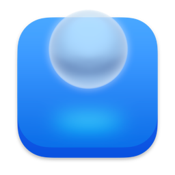

# 
<p align="center">

<h1 align="center">TopitToo</h1>
<h3 align="center">Pin any window to the top of your screen<br><br>
<a href="./README_zh.md"></a>
<a href="https://lihaoyun6.github.io/topit/"></a></h3> 
</p>

## Screenshots
<p align="center">
<picture>
  <source media="(prefers-color-scheme: dark)" srcset="./img/preview_dark.png">
  <source media="(prefers-color-scheme: light)" srcset="./img/preview.png">
  
</picture>
</p>


<!--
## Installation and Usage
### System Requirements:
- macOS 13.0 and Later  

### Installation:
Download the latest installation file [here](../../releases/latest) or install via Homebrew:  

```bash
brew install lihaoyun6/tap/topit
```

### Usage: 
- TopitToo can pin windows from any application to the top of your workspace.  

- Just open TopitToo and select the window you want to pin, and it will do the rest.  
- TopitToo can pin any number of windows. You can move, resize or interact with them at any time.  

## Q&A
**1. Why does TopitToo need screen recording and accessibility permissions?**
> TopitToo uses the accessibility permissions and screen recording permissions to control and capture your windows.  

**2. Does TopitToo consume a lot of power?**
> TopitToo uses ScreenCapture Kit to capture windows with a lower CPU overhead. But it may still drain the battery faster when you pin too many windows. 

## Donate


## Thanks
[Sparkle](https://github.com/sparkle-project/Sparkle) @Sparkle  
[ChatGPT](https://chat.openai.com) @OpenAI  
-->